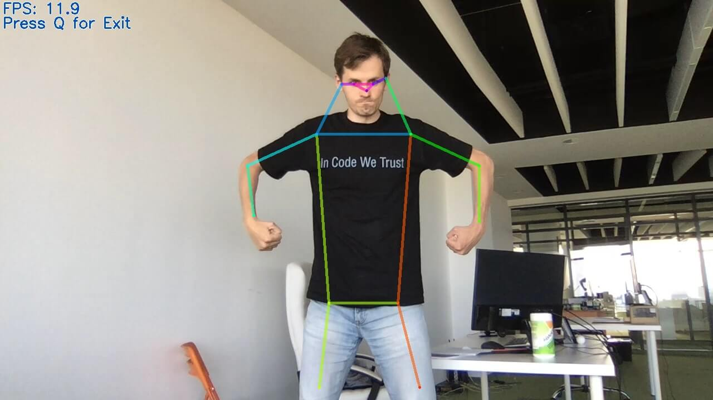

# Innocamp Pose Estimation

Это демо репозиторий, на основе которого вы можете создать свою игру.

### Установка

Для начала вам потребуется установить [OpenVino](https://docs.openvinotoolkit.org/). С помощью этого фреймворка детектор поз будет отрабатывать более `10 FPS` на современном железе.

Качаем OpenVino [отсюда](https://software.intel.com/content/www/us/en/develop/tools/openvino-toolkit/download.html) после регистрации. Инструкция по установке [тут](https://docs.openvinotoolkit.org/latest/installation_guides.html).

### Запуск

Для установки переменных окружения в терминале предварительно вызываем:
```
source /opt/intel/openvino_2021/bin/setupvars.sh
```

Запуск:
```
python3 main_simple.py
```


